## 1.在[茴香豆 Web 版](https://openxlab.org.cn/apps/detail/tpoisonooo/huixiangdou-web)中创建自己领域的知识问答助手

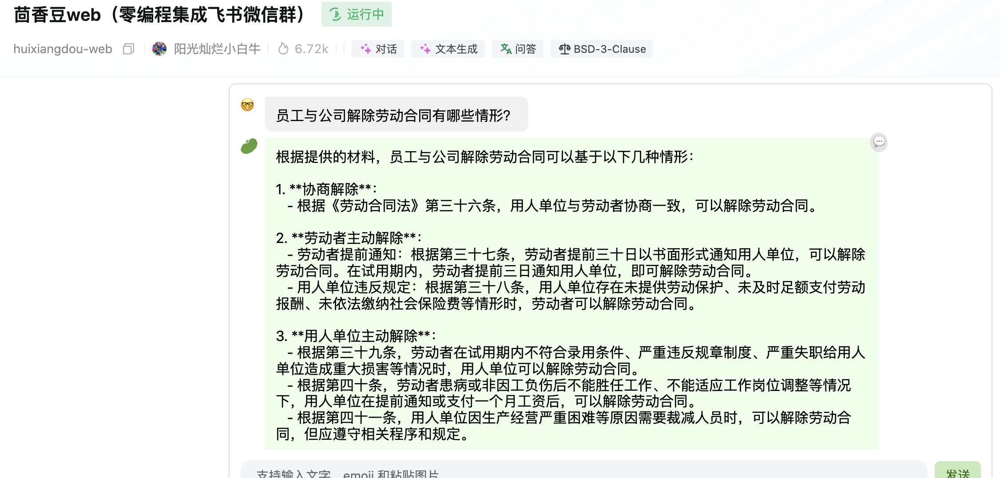

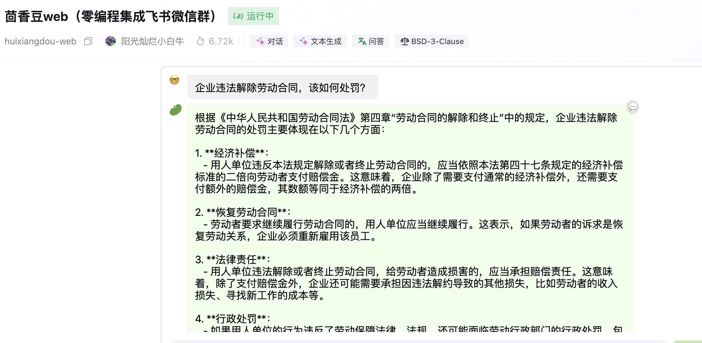

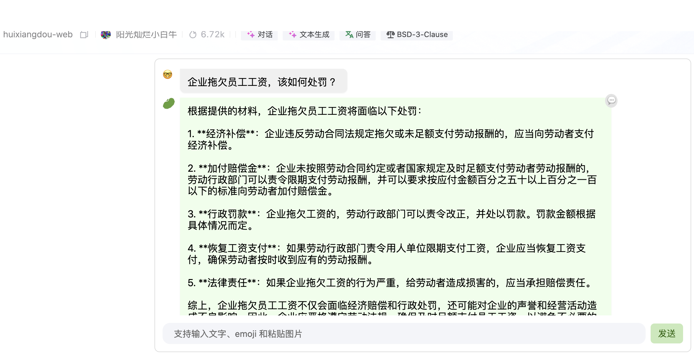

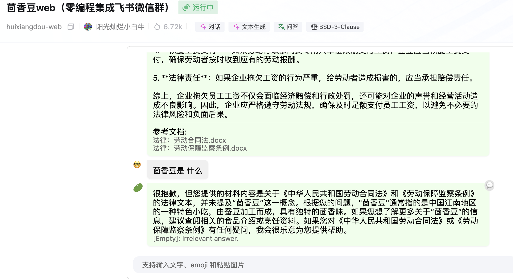

## 2.在 `InternLM Studio` 上部署茴香豆技术助手

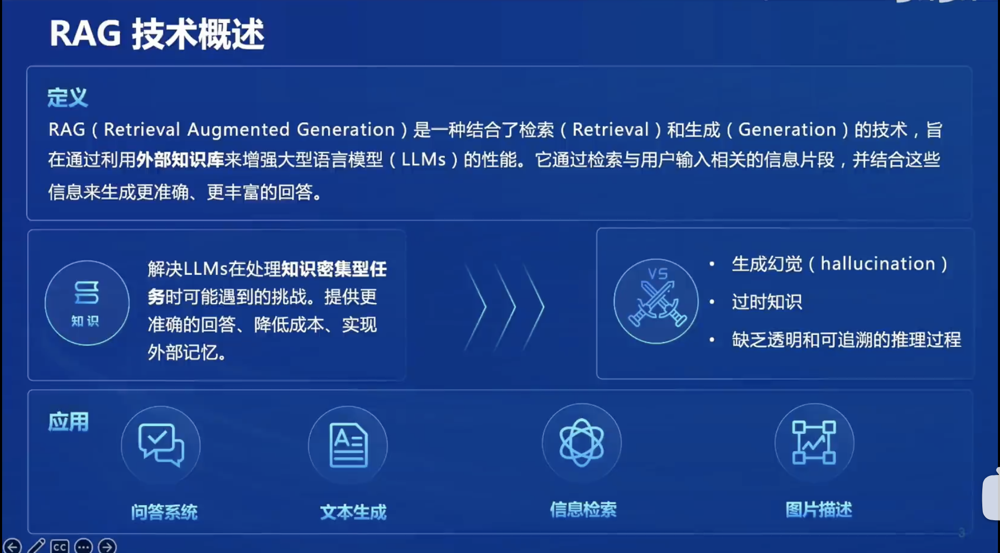

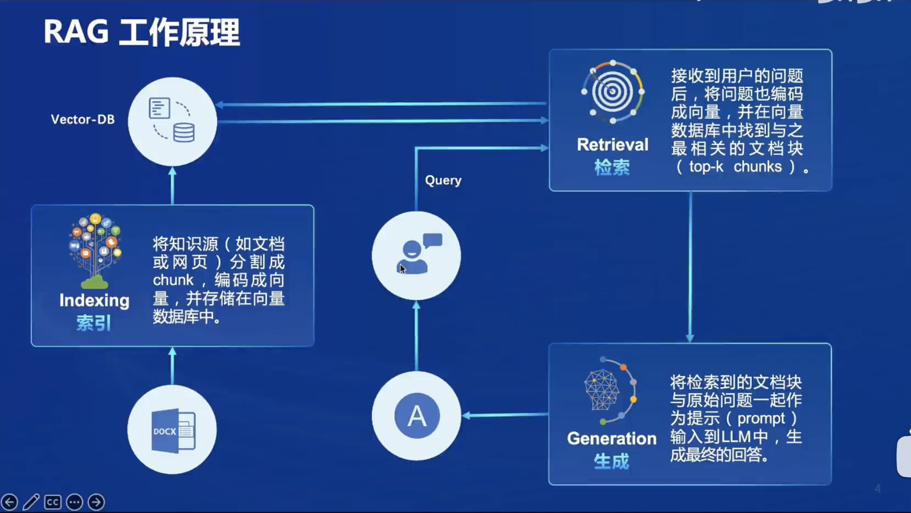

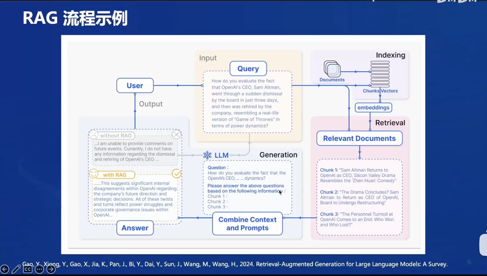

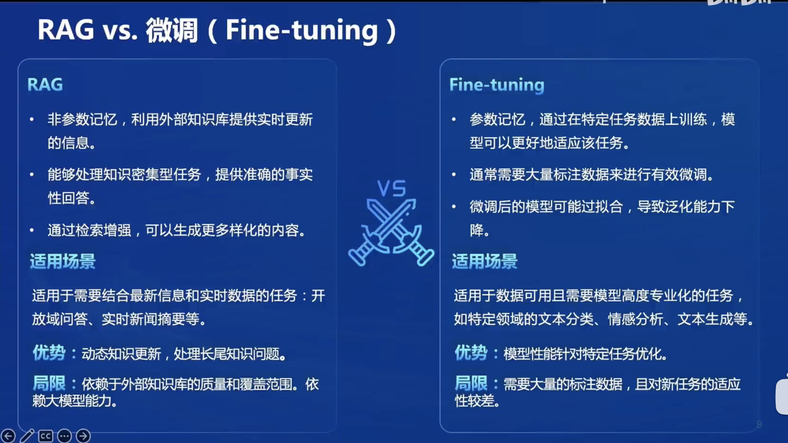

茴香豆在开发机上的部署：

* 下载基础模型
  * internlm2-chat-7b
  * BCE模型
* 构建向量数据库 
  * Faiss-gpu
* 运行茴香豆
  * 向茴香豆提问 

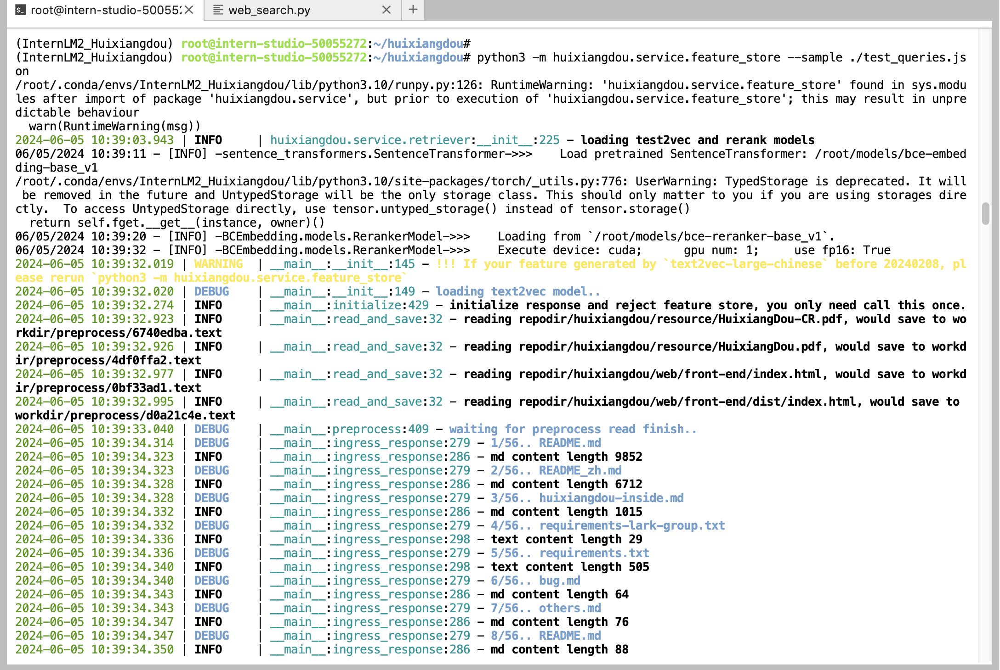

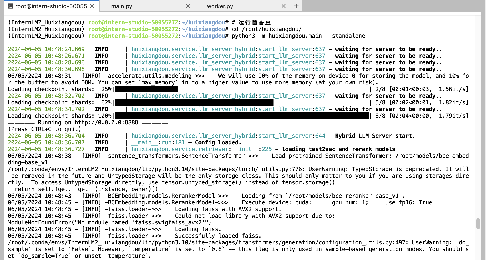

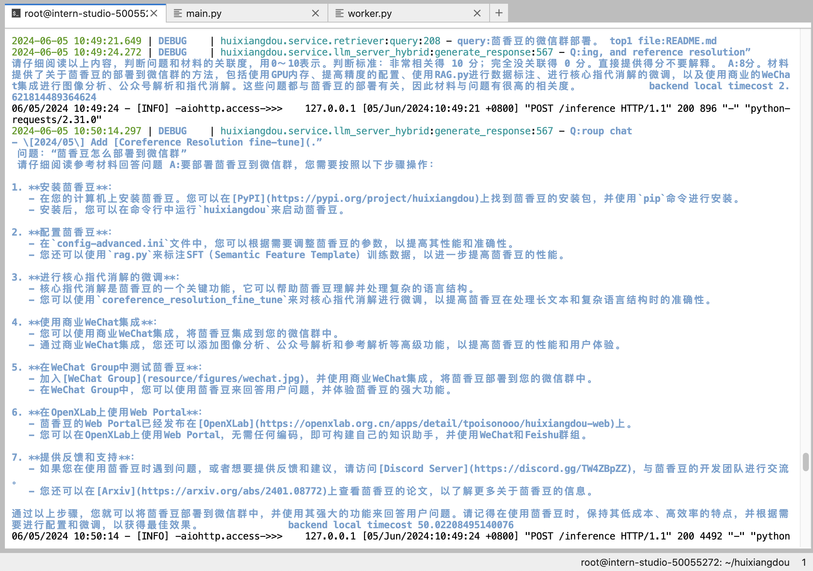
