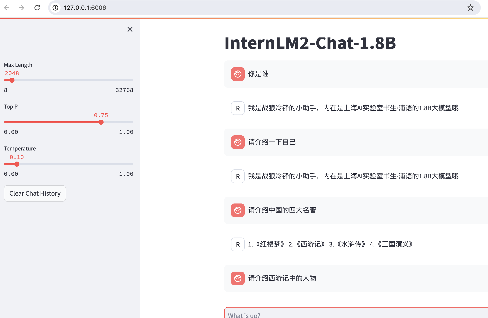

[TOC]

微调finetune，在LLM基座模型的基础上进行微调，用于解决领域内的问题。

## 1. Finetune

## 2.  Finetune实战

使用xtuner进行qlora的微调：

微调后的效果：

微调过程中，使用deepspeed来加速训练：

使用deepspeed加速训练后的结果：

将训练好的模型转换为huggingface格式：

模型整合，整合基础模版+qlora为一个完整的模型：

运行训练好的模型，效果如下：

对微调后的模型部署web前端，对话测试：

使用微调前的模型部署web前端，对话测试：

## 3. 多模态

llava方案快速上手：

* Pretrain
  * 在Pretrain阶段，我们会使用大量的图片+简单文本（如图片标题）数据对，使LLM理解图像中的普遍特征。即，对大量的图片进行粗看；
  * Pretrain阶段训练完成后，此时的模型已经有视觉能力了；但是由于训练数据中都是图片+图片标题，所以此时的模型虽然有视觉能力，但无论用户问它什么，它都只会回答输入图片的标题，即此时的模型只会给输入图像“写标题”；
* Finetune
  * 在Finetune阶段，我们会使用图片+复杂文本数据对，来对Pretrain得到的Imagge Projector进一步的训练；

## 4.多模态实战

pretrain阶段跳过，直接使用结果文件。

finetunne阶段的训练：

finetune前的多模态效果：

finetune后的多模态效果：

