[TOC]

## 1.笔记

大模型的部署面临的挑战：

* 计算量巨大；
  * 大模型参数量巨大，前向推理时需要进行大量计算；
* 内存开销巨大：
  * 需要将模型参数加载到显存，而模型参数巨大；
  * 为了避免重复计算，会将计算注意力得到的KV进行缓存；
* 访存瓶颈：
  * 大模型推理是”访存密集“型任务；
  * 目前硬件计算速度>>显存带宽，存在验证 的访存性能瓶颈；
* 动态请求：
  * 请求量不确定；
  * 请求时间不确定；
  * Token逐个生成，生成数量不确定；

业界常用的大模型部署方法：

* 模型剪枝Pruning
  * 剪枝是指移除模型中不必要或多余的组件，比如参数，以使模型 更加高效；
  * 通过对模型中贡献有限的冗余参数进行剪枝，在保证性能最低下降的同时，可以减小存储需求、提高计算效率；
* 知识蒸馏Knowlege Distillation:
  * 知识蒸馏是一种经典的模型压缩方法，核心思想是通过引导轻量化的学生模型”模仿“性能更好、结构更复杂的教师模型，在不改变学生模型结构的情况下提供其性能；
* 模型量化Quanntization:
  * 量化技术将传统的表示方法中的浮点数，转换为整数或其它离散形式，以减轻深度学习模型的存储和计算负担；

LMDeploy简介

> LMDeploy由MMDeploy和MMRazor团队联合开发，是涵盖了LLM任务的全套轻量化、部署和服务解决方法。

LMDeploy核心功能：

* 高效的推理：
  * LMDeploy开发了Continuous Batchh，Blocked K/V Cache，动态拆分和耦合，张量并行，高效的计算 Kernel等重要特性；
  * InternLM2推理性能是vLLM的1.8倍；
  * lmdeploy chat -h
* 可靠的量化：
  * LMDeploy支持权重量化和k/v量化；
  * 4bit模型推理效率是FP16下的 2.4倍 ；
  * lmdeploy  lkite  -hh
* 便捷的服务：
  * 通过请求分发服务，LMDeploy支持多模型在多机、多卡上的推理服务；
  * lmdeploy  serve  -h
* 有状态推理：
  * 通过缓存多轮对话过程中Attentionn的k/v，记住对话历史，从而避免重复处理历史会话，显著提升长文本多轮对话场景中的效率；

LMDeploy性能表现：

> LMDeploy  TurboMinnd引擎拥有卓越的推理能力，在各种 规模的模型上，每秒处理的请求数是vLLM的1.36~1.85倍。
>
> 在静态推理能力方面，TurboMind 4bit模型推理速度远高于FP16/BF16推理 ，在小batch时，提高到2.4倍。

LMDeploy推理视觉多模态大模型：

> 新版本的lmdeploy支持对多模态大模型llava的支持 。
>
> 使用pipeline可以便捷运行。

## 2.实战

使用Transformer库运行模型：

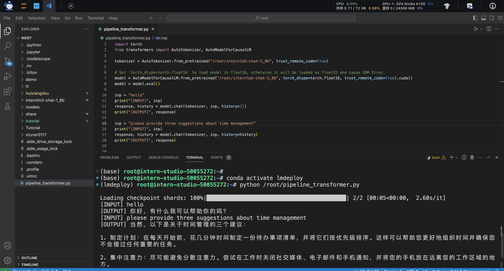

使用LMDeploy与模型对话:

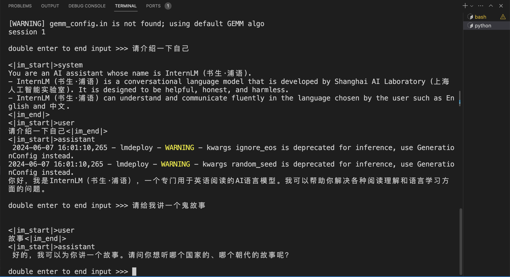

运行1_8b默认参数，观察显存占用：

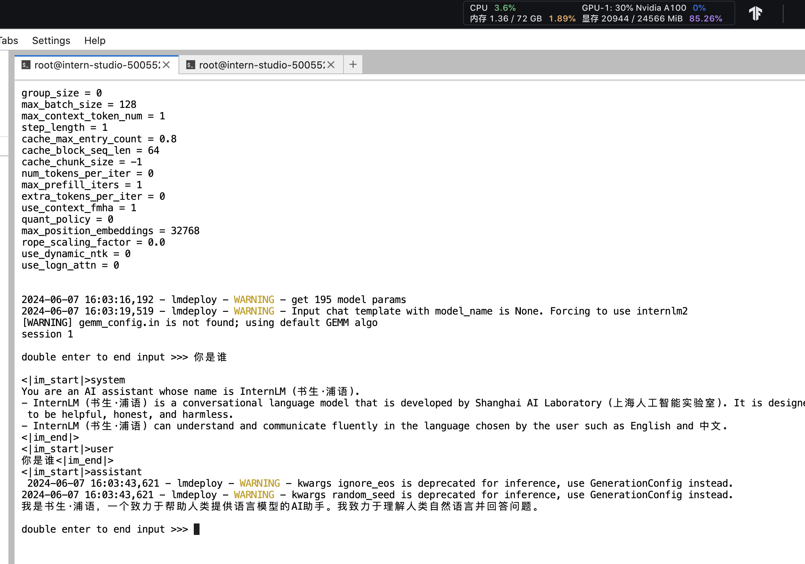
运行1_8b模型 ，设置KV Cache缓存大小=0.4，观察显存占用：

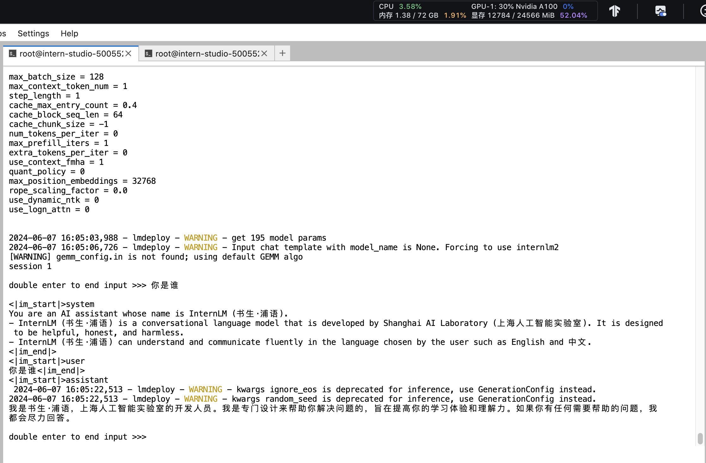

运行1_8b模型 ，设置KV Cache缓存大小=0.01，观察显存占用：

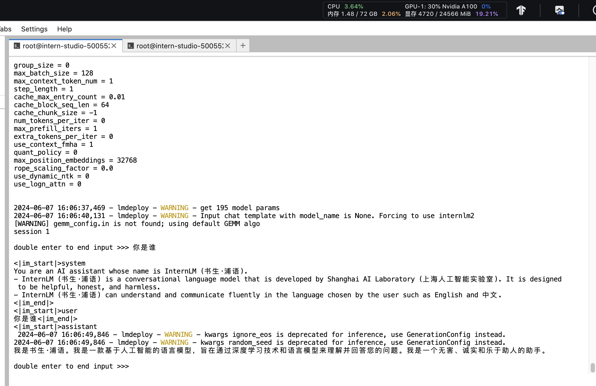

运行1.8b模型，使用W4A16量化，设置KV Cache缓存大小=0.4，观察显存占用：

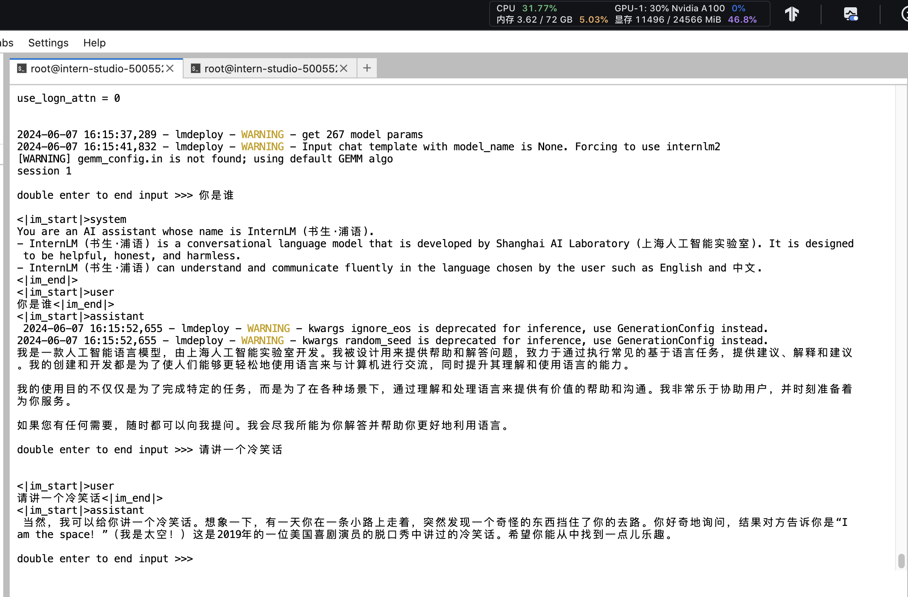

使用LMDeploy服务，在命令行客户端连接API服务器：

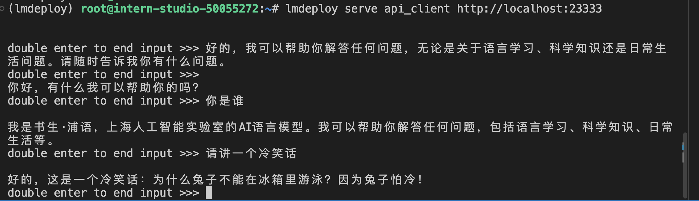

使用LMDeploy服务，在网页客户端连接API服务器：

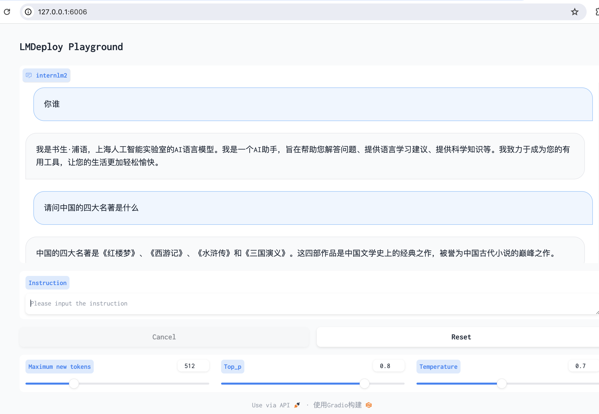

Python代码集成，向TurboMind后端传递参数，配置KV Cache的参数:

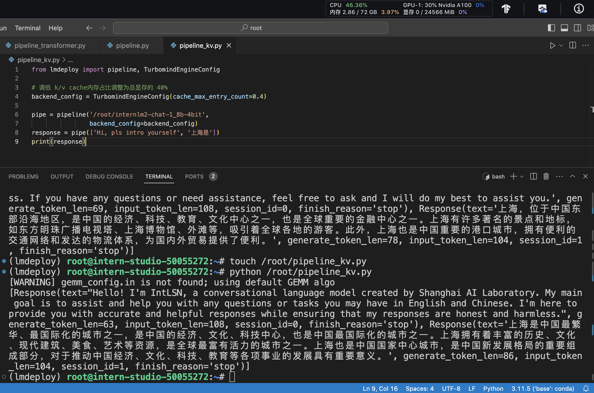

使用LMDeploy运行视觉多模态大模型llava：

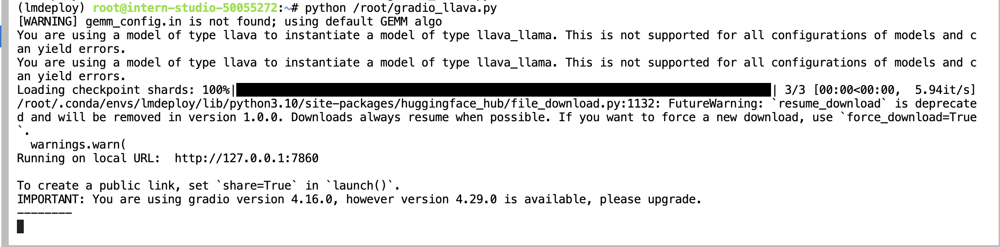

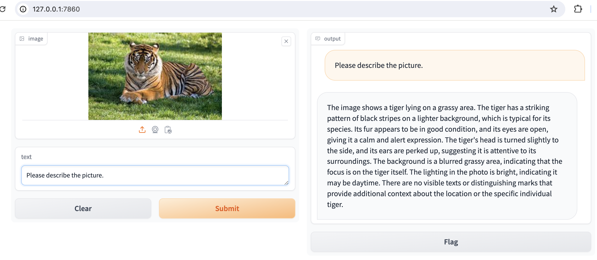

Benchmark: transformers VS lmdeploy

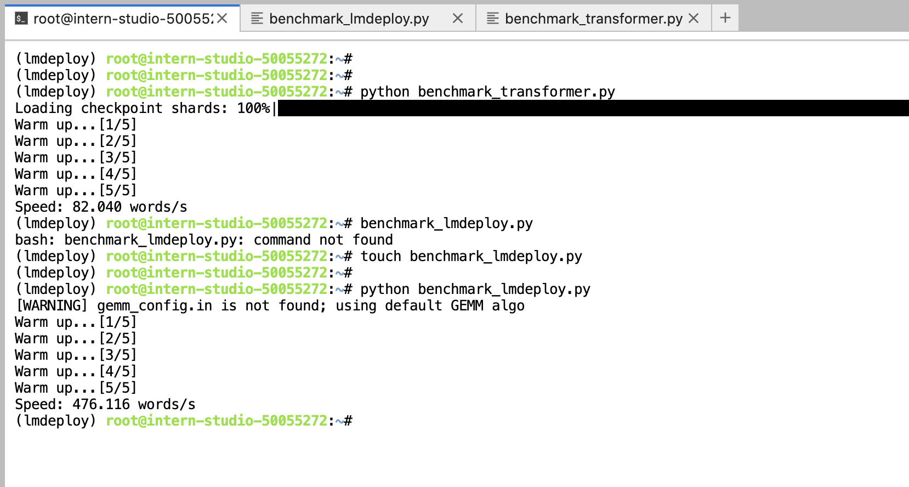
