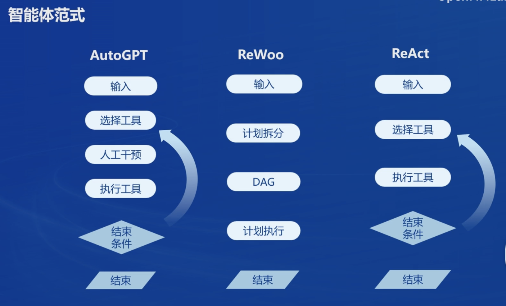
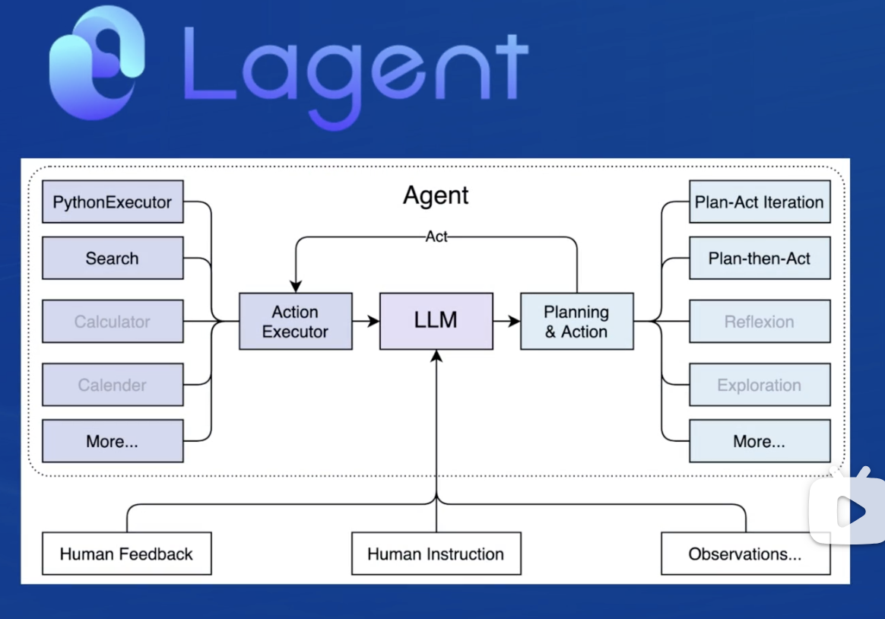
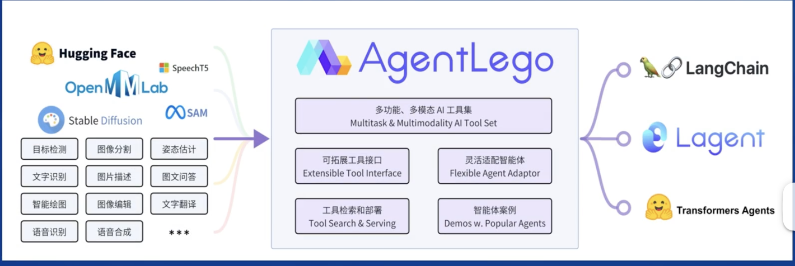
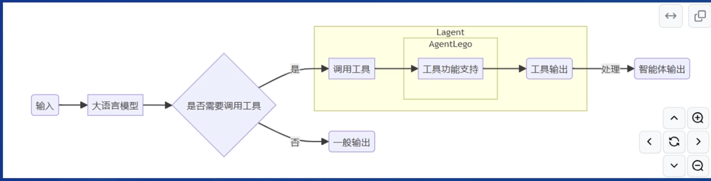
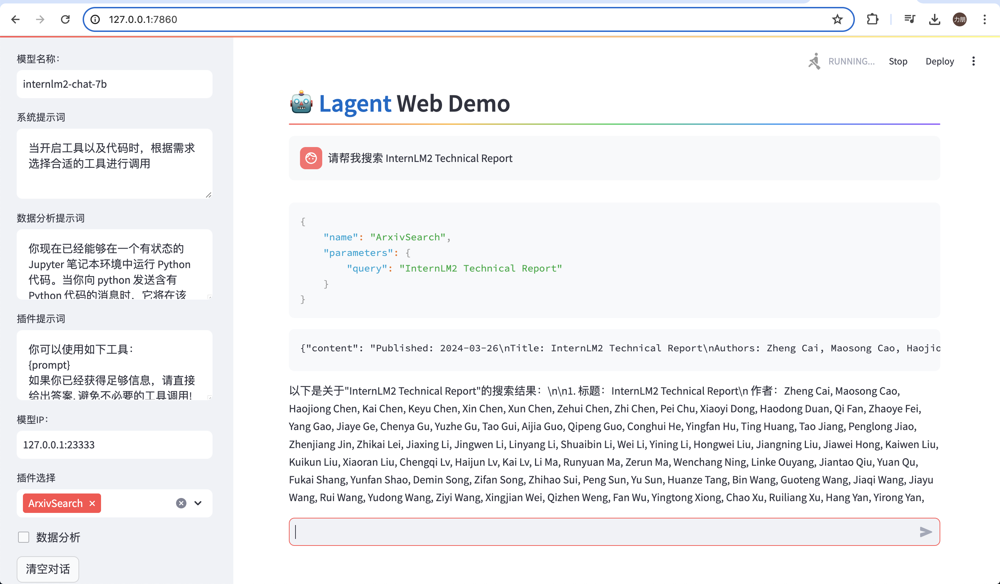
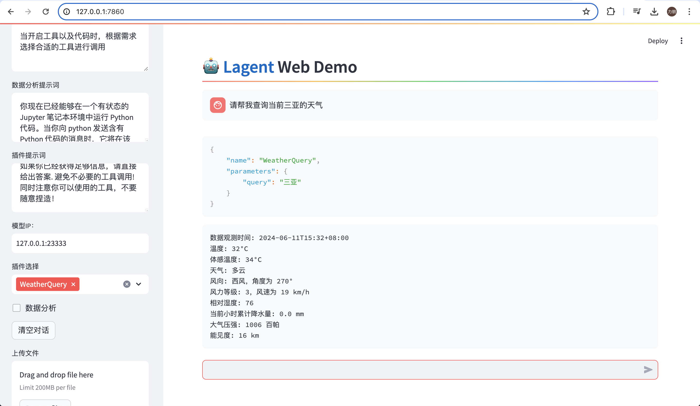
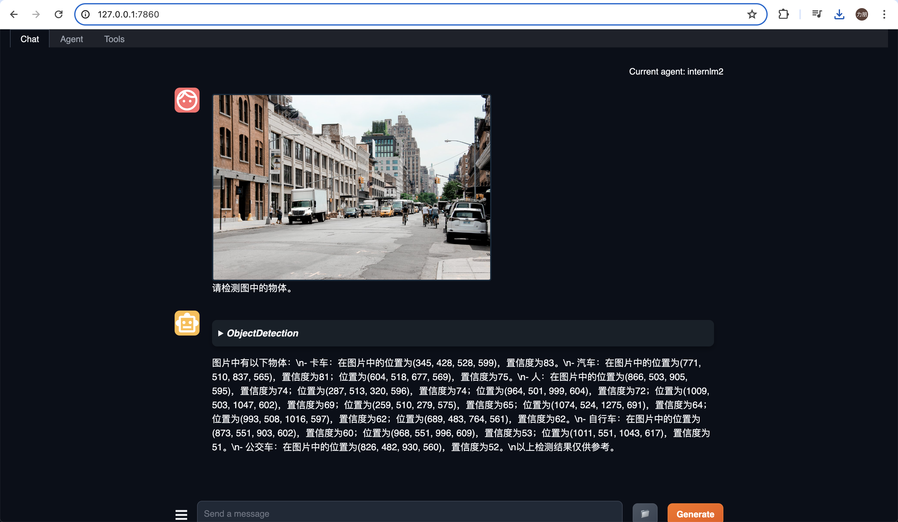

## 1. 笔记

大语言模型的局限性：

* 幻觉：
  * 模型可能会生成虚假新南溪，与现实严重不符或脱节；
* 时效性：
  * 模型训练数据过时，无法反应最新趋势和信息；
* 可靠性：
  * 面对复杂任务时，可能频发错误输出现象，影响信任度；

基于大模型的智能体应运而生。

智能体：

* 可以感知环境中的动态条件；
* 能采取动作影响环境；
* 能运用推理能力理解信息、解决问题、产生推导、决定动作；

智能体的组成：

* 大脑：
  * 作为控制器，承担记忆、思考和决策任务。接受来自感知模块的信息，并采取相应动作。
* 感知：
  * 对外部环境的多模态信息进行感知和处理，包括但不限于图像、音频、视频和传感器等；
* 动作：
  * 利用并执行工具以影响环境，工具可能包括文本的检索、调用相关API、操控机械臂等；

智能体范式：

Lagent:

* 一个轻量级开源智能体框架，旨在让用户可以高效的构建基于大语言模型的智能体；
* 支持多种智能体范式，如AutoGPT、ReWoo、ReAct等；
* 支持多种工具，如谷歌搜索、Python解释器等；

AgentLego:

* 一个多模态工具包，旨在像乐高积木，可以快速简便的拓展自定义工具，从而组装出自己的智能体；
* 支持多个智能体框架 ，如lagent/langchain/transformers agents等；
* 提供大量视觉、多模态领域前沿算法；

lagent与agentlego的关系：

## 2. 实战

Lagent web demo:

用lagent自定义工具，实现一个天气查询的功能：

agentlego作为智能体工具使用：

Agentlego: 用 AgentLego 自定义工具，实现图像生成

