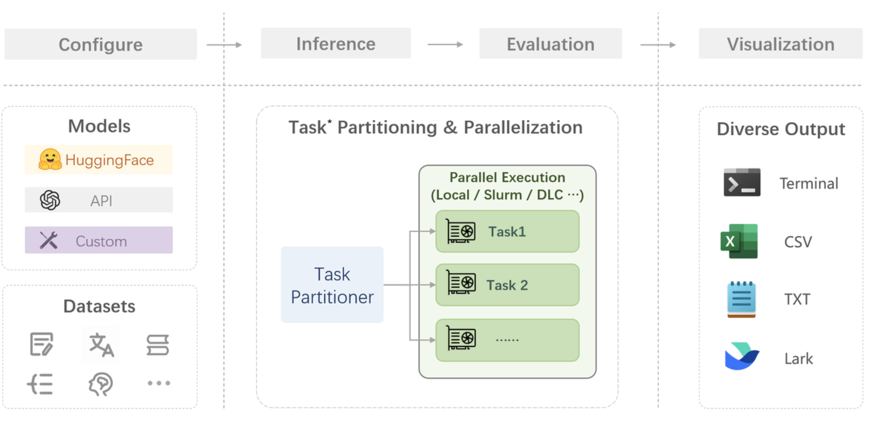
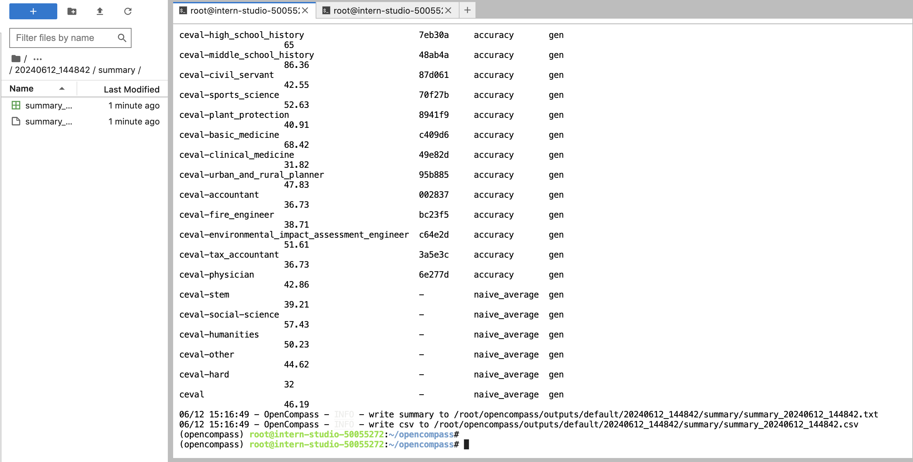
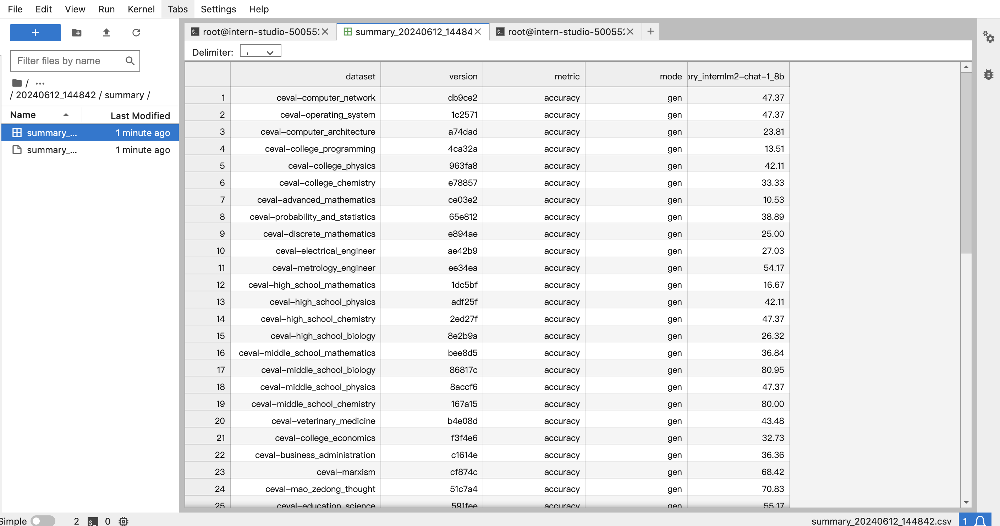
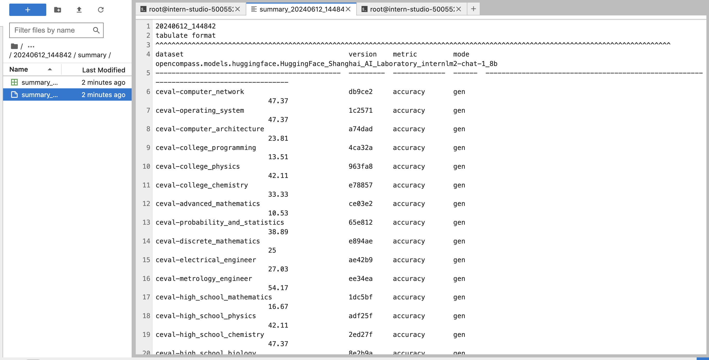

## 1. 笔记

为什么要研究大模型的评测：

* 全面了解大语言模型的优势和限制；
* 指导和改进人类和大语言模型之间的协同交互；
* 更好的规划大语言模型的发展；
* 帮助人们选择适合的模型；


opencompass的特点 ：

* 开源可复现；
* 全面的能力维度；
* 丰富的模型支持；
* 分布式高效评测；
* 多样化评测范式；
* 灵活化拓展 ；


评测方法：opencompass采取客观评测和主观评测想结合的方法

* 客观评测：
  * opencompass采用提示词工程(prompt engineering)和语境学习(in-context learnning)进行客观评测；
* 主观评测：
  * openncompass借助受试者的主观判断具有对话能力的大语言模型进行能力平常；


评测过程：

* 配置：
  * 选择评估的模型和数据集；
* 推理与评估：
  * 推理主要是让模型从数据集产生输出；
  * 评估主要是衡量这些输出与标准答案的匹配程度；
* 可视化：
  * 将结果 整理成易读的表格，保存为csv和txt文件；





## 2. 实战

OpenCompass 评测 internlm2-chat-1_8b 模型在 C-Eval 数据集上的性能。


```shell
python run.py \
--datasets ceval_gen \
--hf-path /share/new_models/Shanghai_AI_Laboratory/internlm2-chat-1_8b \
--tokenizer-path /share/new_models/Shanghai_AI_Laboratory/internlm2-chat-1_8b \
--tokenizer-kwargs padding_side='left' truncation='left' trust_remote_code=True \
--model-kwargs device_map='auto' trust_remote_code=True \
--max-seq-len 1024 \
--max-out-len 16 \
--batch-size 2  \
--num-gpus 1  \
--debug
```


评测结果：






