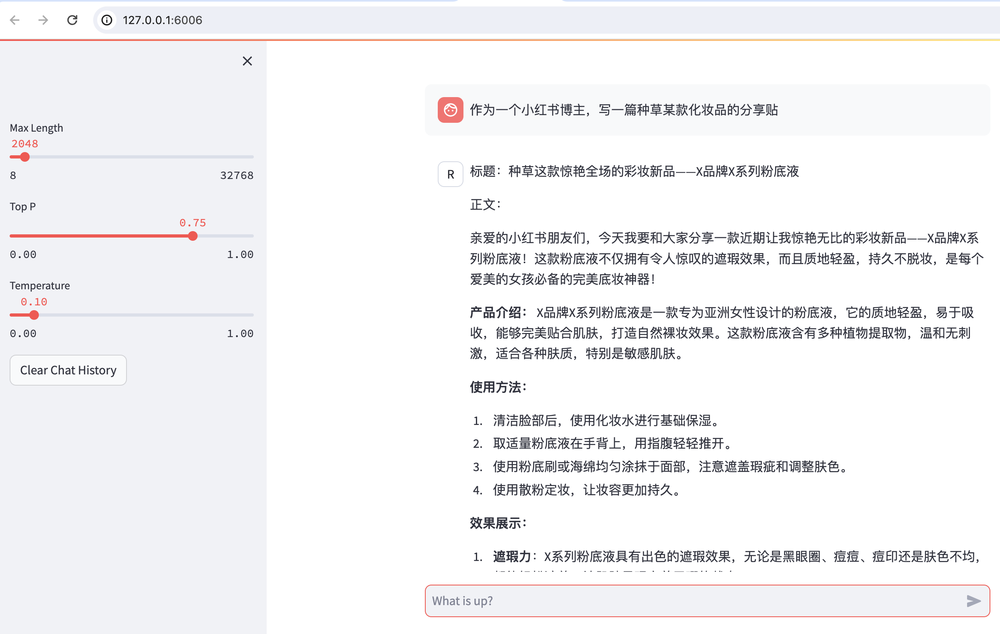

## 1. 笔记

大模型训练的阶段：


SFT: Supervised Finetuning


预训练Pretraining：

* 来源：网络、论文、书籍等；
* 特点：无标签、规模大、质量低、内容杂；
* 公开数据集：万卷、The  pile；
* 模型：GPT3、InternLM-base；
* 模型问题示例：
  * User: 中国的首都是哪里？
  * Assistant: 美国的首都是哪里？


微调Finetune：

* 来源：人工或模型标注的问答对、指令集；
* 特点 ：规模小、质量高、面向特定任务场景；
* 公开数据集：oasst1、Medication  QA、Dolly；
* 模型：chatGPT、InternLM-chat；
* 模型问答实例：
  * User: 中国的首都是哪里
  * Assistant: 中国的首都在北京；


大模型微调Fine-tuning：

* 大模型微调是指在已经训练好的大语言模型基础上，使用特定数据集进一步的训练，以使模型适应特定任务或领域：
* 其根本原理在于，机器学习模型只能够代表它所接收到的数据集的逻辑和理解，而对于其它没有获得的数据样本，其并不能很好的识别/理解，且对于大模型而言，也无法会很好的回答特定场景下的问题；
* 例如，一个通用大模型涵盖了许多语言信息，并能够进行流畅的对话，但如果需要医药方面能够很好的回答患者问题的应用，就需要为这个通用大模型提供很多新的数据以供学习和理解；

指令微调Instruction tuning：

* 指令微调是指在少量数据或有限数据条件下，从已有数据中识别出最有价值的核心样本，并通过微调模型的指令来帮助模型获取下游任务的知识，从而实现较好的性能；
* 这种方法主要针对预训练模型，因为LLM需要大量数据来训练，但是某些情况下，如果我们只希望优化特定任务的性能，则只需要在目标任务数据上微调模型的指令，而不是大量数据上进行微调，可以大大节省时间和计算资源；


微调的目的：

* 预训练模型无法满足需求时：
  * 如专业回答、组织自身的信息；
* Prompt Engineering局限性：
  * 输入过程、推理成本高、效果不理想；
* 数据安全问题：
  * 企业内部数据、敏感数据；
* 需要个性化服务：
  * 微调轻量级模型；


微调的方式：

* 从参数规模的角度划分：
  * 全量微调FFT(Full Fine Tuning)
  * PEFT(Parameter-Efficent Fine Tuning)
    * Prompt Tuning
    * Prefix Tuning
    * LoRA
    * QLoRA
* 从训练数据和方式划分：
  * SFT: Supervised Fine Tuning
  * RLHF: Reinforcement Learning with Human Feedback
  * RLAIF: Reinforcement Learning with AI Feedback


微调的步骤：

* 明确目标任务：角色扮演、数学、写作；
* 选择和测试基座模型；
* 数据准备：收集、清洗、预处理、标注、划分等；
* 设定微调策略：LoRA、QLoRA；
* 设置超参数：学习率、batch-size、epoch；
* 模型初始化；
* 开始微调训练；
* 模型评估和调优：调整数据、策略、超参数；
* 模型性能测试；
* 模型部署；


微调数据质量：

* 好的微调数据
  * 数据质量高；
  * 多样性；
  * 真实数据；
  * 数据量多；
* 查的微调数据
  * 数据质量低；
  * 同质性；
  * 生成数据；
  * 数据量少；


## 2. 实战

使用弱智吧数据进行微调：


使用小红书的数据，对internlm_7b模型进行微调：

```
# 1.训练
xtuner train /root/ft-xhs/config/internlm2_7b_qlora_xhs_e3.py --work-dir /root/ft-xhs/train --deepspeed deepspeed_zero2

# 2.pt转hugggingface
mkdir -p /root/ft-xhs/huggingface
xtuner convert pth_to_hf /root/ft-xhs/train/internlm2_7b_qlora_xhs_e3.py /root/ft-xhs/train/iter_96.pth /root/ft-xhs/huggingface

# 3.将 HuggingFace adapter 合并到大语言模型
mkdir -p /root/ft-xhs/final_model
export MKL_SERVICE_FORCE_INTEL=1
xtuner convert merge /root/ft-xhs/model /root/ft-xhs/huggingface /root/ft-xhs/final_model

# 4.与合并后的模型对话
xtuner chat /root/ft-xhs/final_model --prompt-template internlm2_chat
```


使用web-demo部署微调后的大模型：

```
# 1.部署
streamlit run /root/ft-xhs/web_demo/InternLM/chat/web_demo.py --server.address 127.0.0.1 --server.port 6006

# 2.端口映射
ssh -CNg -L 6006:127.0.0.1:6006 root@ssh.intern-ai.org.cn -p 34978
```



使用lmdeploy部署微调后的模型：

```
# 1. 部署api-server
lmdeploy serve api_server \
>     /root/ft-xhs/final_model \
>     --model-name internlm-7b-chat-xhs \
>     --model-format hf \
>     --quant-policy 0 \
>     --server-name 0.0.0.0 \
>     --server-port 23333 \
>     --tp 1

# 2. 部署gradio前端
lmdeploy serve gradio http://localhost:23333 \
    --server-name 0.0.0.0 \
    --server-port 6006
    
# 4. 配置ssh端口映射
ssh -CNg -L 6006:127.0.0.1:6006 root@ssh.intern-ai.org.cn -p 34978
```


